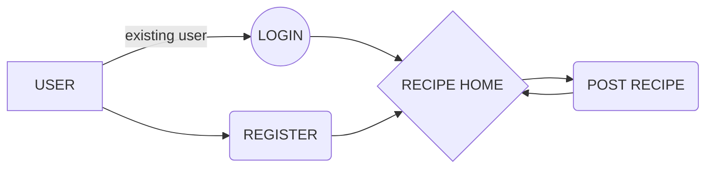
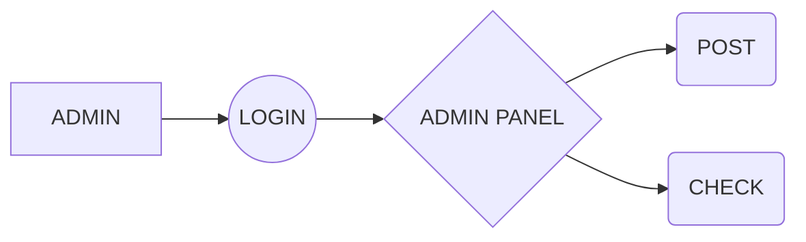

  # RECIPE WEB APP

> <b> This web app is built using django framework.
>  It's based on  cooking recipe .
> 
```
In this web app, there few modules ,
```
## MODULES
 - <i>signin and signup module.
 - <i>post recipe module.
 - <i>admin module.


| Modules | Description |
| ------:| -----------:|
| signin/signup  | These modules provides the user to create a own username and password. and also used to login . |
|Post Page|This module the user can create his own recipe and post to home page.
|Admin|The module can control all other post and also post to home page  . And also have the previlege to delete a user from the site.
| 


 - ###  FLOW CHART FOR USER LOGIN 



-  ### FLOW CHART FOR ADMIN 





